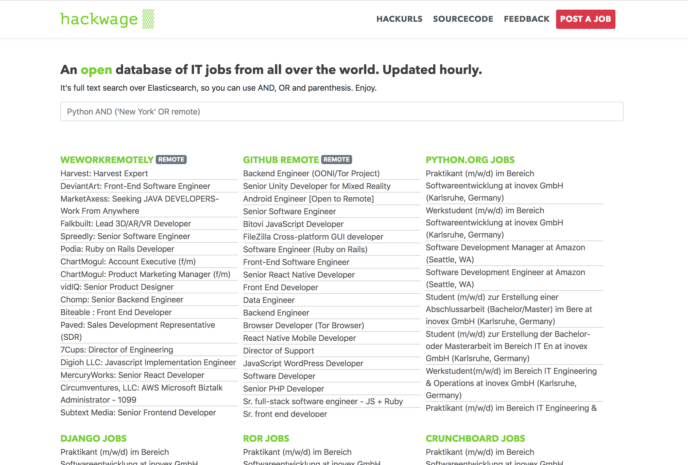

# hackwage
Hackwage is a RSS/JSON aggregator and search-engine for IT Jobs.
It can be easily adapted for other projects, for example to fetch and search News.

The website is based on Python/Django and ElasticSearch, while the live data is ingested via NodeJS.

[<kbd></kbd>](https://hackwage.com)

## How to run it (Debian)

#### Create Python Virtual Env
```
$ git clone https://github.com/santinic/hackwage.git
$ cd hackwage
$ virtualenv -p python3 venv3
$ source venv3/bin/activate
$ pip install -r requirements.txt
```

#### Run ElasticSearch
Install the latest ElasticSearch on your Debian box,
[as documented here](https://www.elastic.co/guide/en/elasticsearch/reference/current/deb.html).
Then start it:
```
$ systemctl service start elasticsearch
```

#### Setup NodeJS and start ingesting data
```
$ cd node
$ npm install
$ npm run ingest
```
The script will try to fetch all the default data sources, you shouldn't get any error at this stage.

#### Setup a Cron Job
You can set up a cronjob to fetch data every hour.
Just run `crontab -e` and add a line like this:
```
0 * * * * cd /hackwage-path/node/ && npm run ingest >/dev/null 2>&1
```

#### Setup and run Django server
```
$ ln -s dj/dev_settings.py dj/settings.py
$ python manage.py migrate
$ python manage.py runserver
```

Now you should be able to access hackwage on you local machine on port 8000.

#### Cache
Hackwage makes use of Memcached cache the home page.
It's already set up in the default settings, so you just need to
install and run Memecached:
```
$ sudo apt install memcached
$ sudo systemctl start memcached
```


## Adding RSS sources
You can add any number of RSS source url, editing the file `/sources.json`.
It should be a JSON file with a list of objects structured like this one:
```json
{
    "name": "StackOverflow Jobs",
    "url": "https://stackoverflow.com/jobs/feed",
}
```


## Todo

- Dockerize


## License
Hackwage is distributed under GPL3. So you can deploy as many clones
of hackwage.com as you wish, as long as you link back to this sourcecode
and share any improvements you made to it.